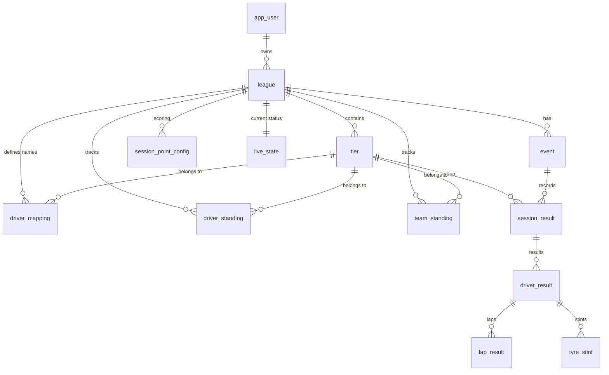

# F1 25 Telemetry & Racing League Management

A multi-tenant racing league management system designed for F1 25. This project allows multiple users to host their own leagues, track driver/team standings, and view live race dashboards using real-time telemetry data.

## Project Structure

- **`cloud-server`**: A Spring Boot + Vaadin web application that manages leagues, users, and displays live leaderboards.
- **`local-collector`**: A lightweight Java application that sits between your F1 game and the cloud. It captures UDP telemetry from the game and forwards it to your specific league on the cloud server.
- **`android-collector`**: An Android application that performs the same role as the `local-collector`, allowing you to use your phone or tablet as a telemetry bridge.

## Getting Started

### 1. Cloud Server Setup
1. Navigate to `cloud-server`.
2. Run the application: `mvn spring-boot:run`.
3. Open `http://localhost:8080` in your browser.
4. **Register** a new account or use the default (`user` / `password`).

### 2. Create a Season
1. Once logged in, go to the **Seasons** page.
2. Enter a name (e.g., "Season 2026") and click **Add Season**.
3. You will see a unique **Telemetry Token** (UUID). Click **Copy** to save it to your clipboard.

### 3a. Local Collector Setup (Desktop)
1. Navigate to `local-collector`.
2. Open `src/main/resources/application.properties`.
3. Update `telemetry.cloud.token` with the UUID you copied from the server.
4. Update `telemetry.cloud.url` if your server is hosted remotely.
5. Run the collector: `mvn spring-boot:run`.

### 3b. Android Collector Setup (Mobile)
1. Build and install the APK from `android-collector` to your device.
2. Open the app and go to **Settings**.
3. Enable **Cloud Forwarding** and paste your **Telemetry Token** into the **Cloud UUID** field.
4. Go to the **Dashboard** and click **Start Collector**.
5. Note the **IP Address** shown on the dashboard.

### 4. Game Configuration
1. In F1 25, go to **Settings > Telemetry Settings**.
2. Set **UDP Telemetry** to `On`.
3. Set **UDP IP Address** to the IP of the machine/device running the collector.
4. Set **UDP Port** to `20777`.
5. Set **UDP Format** to `2025`.

### 5. View Live Dashboard
1. On the Cloud Server **Seasons** page, click **Live Dashboard** next to your active season.
2. This link is public—you can share it with friends or viewers without them needing to log in!

---

## Database Model

## Development
- **Java**: 21
- **Framework**: Spring Boot 4.0, Vaadin 25
- **Database**: PostgreSQL 16 (Managed via Liquibase)
- **Containerization**: Docker Compose for local database, Jib for cloud deployment
