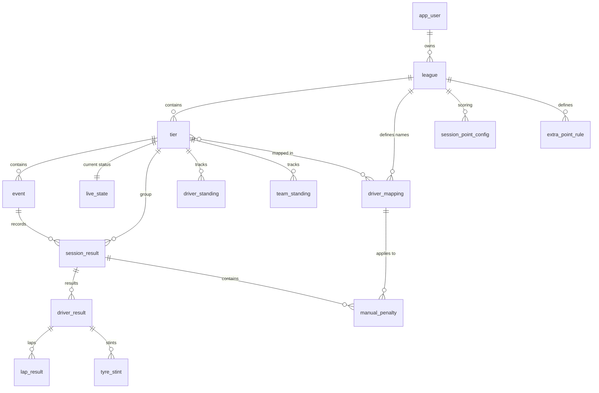

# F1 25 Telemetry & Racing League Management

A multi-tenant racing league management system designed for F1 25. This project allows multiple users to host their own leagues, track driver/team standings, and view live race dashboards using real-time telemetry data.

## Key Features

- **Multi-Tier Support**: Split each season (league) into multiple tiers (e.g., Tier 1, Tier 2), each with its own events, telemetry token, and live leaderboard.
- **Sprint Races**: Full recording, display, and point tracking for Sprint Races, complete with standard/customizable sprint points and event results.
- **Advanced Race Analytics**:
  - **Pure Race Pace**: Weighted sector analysis filtering out traffic and safety car outliers.
  - **Longest Stints**: Tyre compound stint telemetry and average pace with 107% rule filtering.
  - **Consistency Rating**: Heat mapping and delta scoring based on sector stability.
- **League-Wide Standings**: Aggregate team standings tracking across all tiers of a season, alongside individual tier-based driver and team standings.
- **Custom Point Configurations**: Flexible point setups for any session type (Races, Sprints, etc.), with dynamic extra point rules (e.g., most places gained, fastest lap, closest gap, or cleanest driver) configurable via custom SpEL expressions.
- **Live Spectator Dashboard**: Public real-time dashboard displaying tyre wear, ERS usage (with active overtake highlighting), and lap times.

## Driver & Lineup Management

The platform includes a robust driver mapping and event lineup system:

- **Driver Mapping & Management**: Grid-based management of drivers mapped from telemetry names, race numbers, driver IDs, and countries to human-friendly display names. Supports manual driver mapping creation.
- **Reserve Handling**: Easily toggle drivers as reserves. Checking a driver as a reserve automatically clears and disables their team assignment, since reserves do not belong to active teams.
- **Strict 2-Driver-per-Team Capacity**: Enforced strictly per-tier. When attempting to assign a third active driver to a team within the same tier:
  - A modal replacement dialog appears listing the 2 existing active drivers.
  - Selecting an existing driver to replace immediately disables interaction, displays a busy message, and converts the replaced driver to a reserve with no team.
- **Cross-Tier Copying**: Mapped drivers can be copied to other tiers within the same league.
  - Validates that the driver is not already mapped in the target tier (checks matching telemetry name, race number, driver ID, and country).
  - Prompts for reserve and team assignments, enforcing the same 2-driver team capacity rules in the target tier.
- **Car Type & F1 26 Dual-Encoding**:
  - League general settings determine the car type ("F1 25" or "F1 26").
  - F1 26 configurations filter team choices to only show official 2026 teams (IDs >= 400).
  - Telemetry dual-encoding (uint16 IDs like 476 and truncated uint8 IDs like 220) is handled seamlessly via name-based matching, ensuring the correct team is always pre-selected when editing.
- **Event Lineup Syncing**: Under the Event Results page, coordinators can view and edit the event lineup. Clicking **Update with Real Lineup** clears the current lineup and automatically populates it with non-AI human drivers and team mappings recorded in actual telemetry session results.

## Project Structure

- **`cloud-server`**: A Spring Boot + Vaadin web application that manages leagues, users, and displays live leaderboards.
- **`local-collector`**: A lightweight Java application that sits between your F1 game and the cloud. It captures UDP telemetry from the game and forwards it to your specific league tier on the cloud server.
- **`android-collector`**: An Android application that performs the same role as the `local-collector`, allowing you to use your phone or tablet as a telemetry bridge.

## Getting Started

### 1. Cloud Server Setup
1. Navigate to `cloud-server`.
2. Run the application: `mvn spring-boot:run`.
3. Open `http://localhost:8080` in your browser.
4. **Register** a new account or use the default credentials (`user` / `password`).

### 2. Create a Season & Retrieve Telemetry Token
1. Go to the **Seasons** page and click **Add Season** to create a new league (e.g., "Season 2026").
2. Click **Details** on your newly created season.
3. Under the **Tiers** tab, copy the **Telemetry Token** (UUID) for your desired tier. Tiers can also be added, deleted, or renamed here.

### 3a. Local Collector Setup (Desktop)
1. Navigate to `local-collector` and run `mvn spring-boot:run`.
2. In the desktop interface under **Collector Settings**, paste the **Telemetry Token** (UUID) you copied from the cloud server.
3. Check **Enable Cloud Sync** and click **Save & Apply**.
*(Note: You can also manually configure `src/main/resources/application.properties` before running).*

### 3b. Android Collector Setup (Mobile)
1. Build and install the APK from `android-collector` to your device.
2. Open the app and go to **Settings**.
3. Enable **Cloud Forwarding** and paste your **Telemetry Token** into the **Cloud UUID** field.
4. Go to the **Dashboard** and click **Start Collector**.
5. Note the **IP Address** shown on the dashboard.

### 4. Game Configuration
1. In F1 25, go to **Settings > Telemetry Settings**.
2. Set **UDP Telemetry** to `On`.
3. Set **UDP IP Address** to the IP of the machine/device running the collector (`127.0.0.1` if running locally).
4. Set **UDP Port** to `20777`.
5. Set **UDP Format** to `2025`.

### 5. View Live Dashboard
1. On the Cloud Server **Season Details** page, go to the **Tiers** tab.
2. Click **Live Dashboard** next to your active tier.
3. This link is public—you can share it with friends or viewers without them needing to log in!

---

## Database Model

```mermaid
erDiagram
    app_user ||--o{ league : "owns"
    league ||--o{ tier : "contains"
    league ||--o{ driver_mapping : "defines names"
    league ||--o{ session_point_config : "scoring"
    league ||--o{ extra_point_rule : "defines"
    
    tier ||--o{ event : "contains"
    tier ||--|| live_state : "current status"
    tier ||--o{ session_result : "group"
    tier ||--o{ driver_standing : "tracks"
    tier ||--o{ team_standing : "tracks"
    tier }o--o{ driver_mapping : "mapped in"
    
    event ||--o{ session_result : "records"
    session_result ||--o{ driver_result : "results"
    session_result ||--o{ manual_penalty : "contains"
    driver_mapping ||--o{ manual_penalty : "applies to"
    driver_result ||--o{ lap_result : "laps"
    driver_result ||--o{ tyre_stint : "stints"
```

## Development
- **Java**: 21
- **Framework**: Spring Boot 4.0, Vaadin 25
- **Database**: PostgreSQL 16 (Managed via Liquibase)
- **Containerization**: Docker Compose for local database, Jib for cloud deployment
